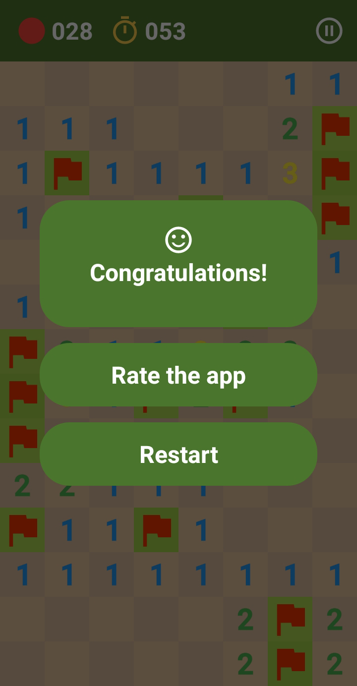
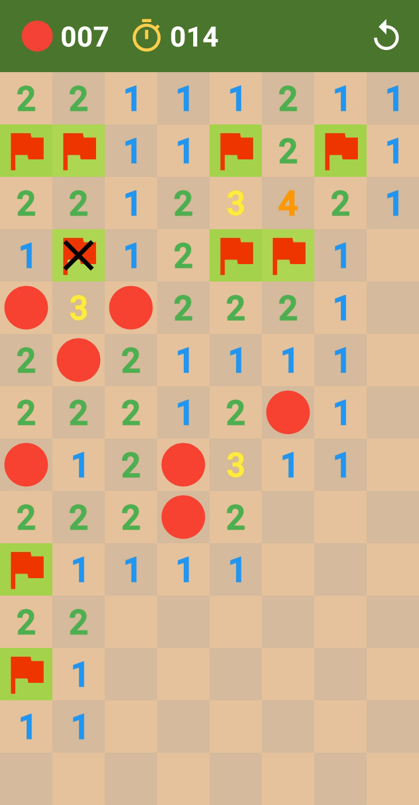

# Minesweeper Rebirth
Minesweeper Rebirth was made during the fall of 2018. The purpose of this app is to give players an enjoyable Minesweeper experience.
| | | |
|:-------------------------:|:-------------------------:|:-------------------------:|
|   |  ||
|  |  ||
|  |  ||

# Skills Demonstrated
* Built an Android and Java-based game engine from scratch, which was used to create a fully functional 2D gaming experience.
* Published the app on the Google Store and effectively used the AdMob API to monetize the app.

# Technologies Used
* Java
* Android SDK

# Impact
* More than 100 people downloaded and enjoyed playing Minesweeper Rebirth until it got taken down around the end of 2020 because of too many similarities with other minesweeper games.

# Inspiration
* The inspiration behind Minesweeper Rebirth was [Google's Minesweeper](https://www.google.com/search?q=play+minesweeper).
